# Sushi Restaurant

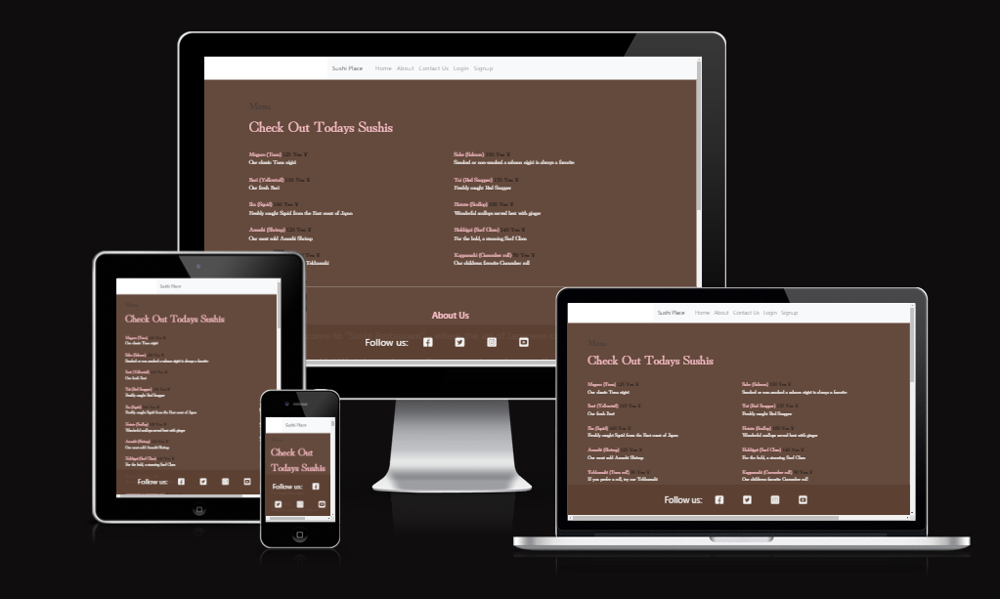

The goal for this project was to create a fictional sushi restaurant with a functional booking system, a menu, and some other information about the restaurant. The user can signup to be able to make bookings to the restaurant with some key information such as: what time they want to book the table, how many guests and if they have any allergies, special requests etc. 

The live link can be found here: [Sushi Restaurant](https://restaurant-booking-app-p4-62d98244b1cc.herokuapp.com/)

## User Experience (UX)

### Project Goals

The goal of this project was to build a working booking system for a fictional restaurant so that customers would have an easy way to create, update and delete their bookings on. The goal was not so much to make it visually impressive but to make it functional and easy to understand.

* First Time Visitor Goals
    * As a first time visitor I can signup to the booking system in order to in the future be able to create bookings.
    * As a first time visitor I can read the menu to see if the food is interesting and appealing.
    * As a first time visitor I can learn about the restaurant, some key information and location as well as how to get in contact via email, phone or social media.

* Returning Visitor Goals
    * As a returning visitor I can create an account so that in the future I can make my first booking
    * As a returning visitor I can check the menu to see if there are any specials or if the menu has changed.

* Frequent User Goals
    * As a frequent user I can login to manage already existing bookings.
    * As a frequent user I can find my current bookings.

### Agile Methodology

* An agile approach was taken when creating this project. By assigning user stories to common issues and taking advantage of the GitHub Kanban board and its features, the process of making sure that everything that was needed was included in the project in order to make a user friendly and accesible.

### Design

* The design for the project was structured to be easy to read, easy to understand where to get the inforamtion you would need in order to access the website like how it was intended.
* The main colors for this project a lighter brown with some pink, black and white details on the front page to give a high contrast of colors and make everything easy to read.

### Wireframes

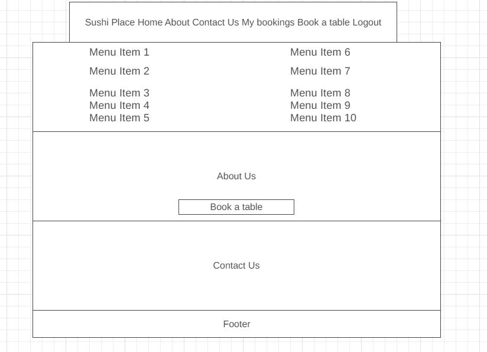
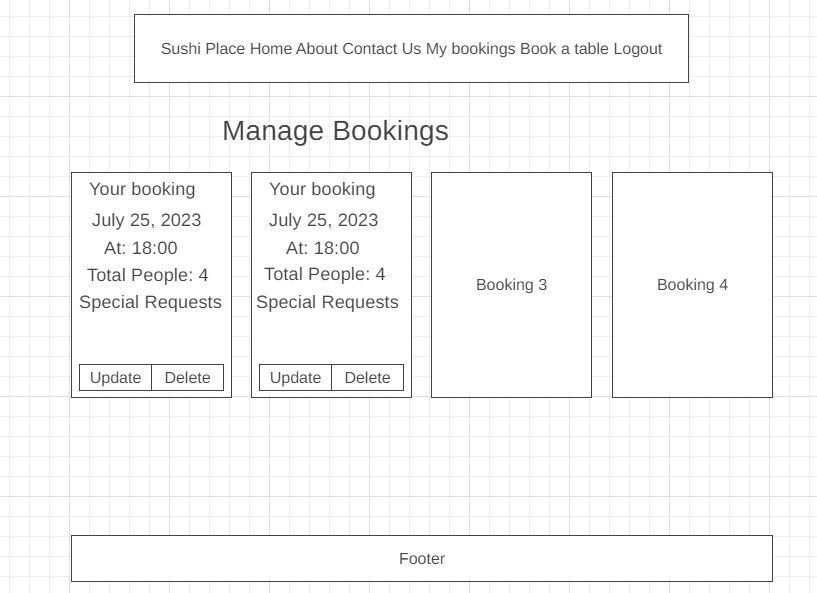
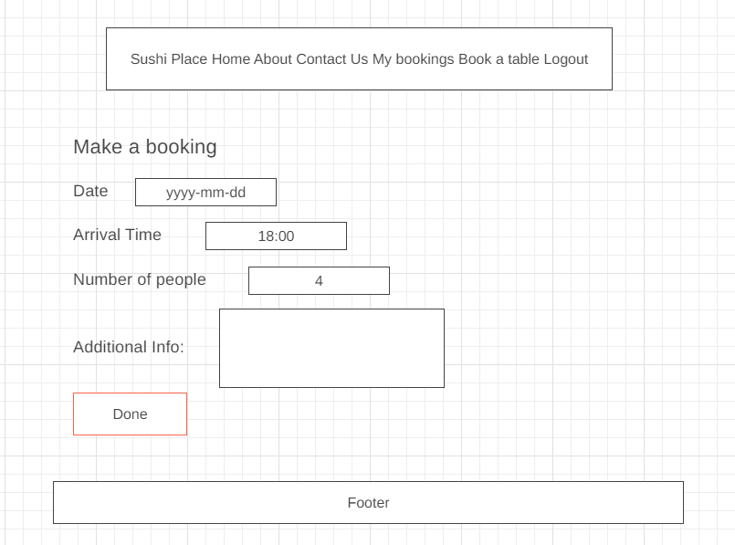
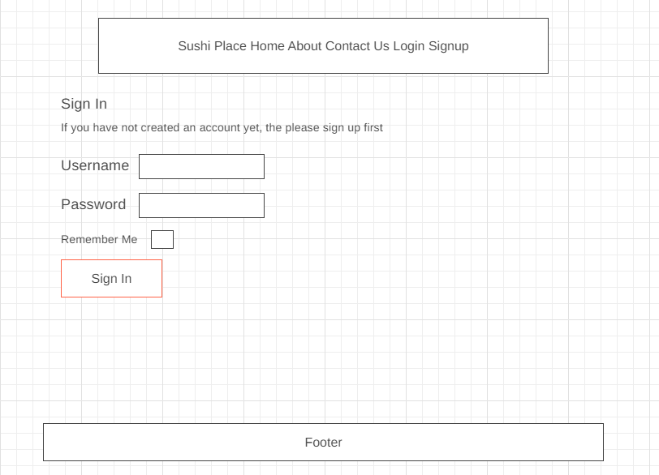
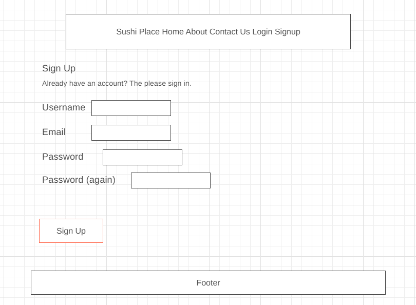

### Database Schema
* The database schema can be found below where there is a foreign key field of User that realtes to the Django standard User model class.

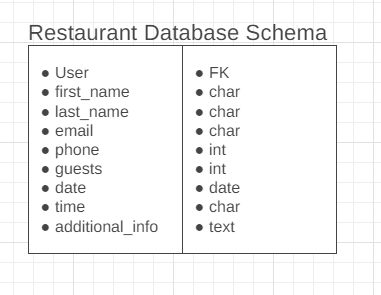

## Features

### Navbar
* The navbar shows all the sections you can access whilst logged in or logged out. If you're logged in, the navbar will update so that you can easily access your bookings page and also quickly make a new booking. If the user is not logged in, they will instead be shown links to login and signup.

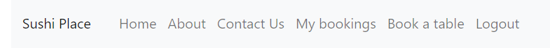

### Menu
* The menu section comes with everything the restaurant has to offer, it shows the sushis name in both japanese and english and also it's price in Yen, the currency of Japan to achieve that luxury abroad feeling.

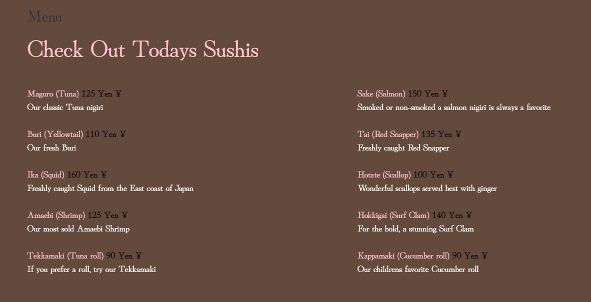

### About Us
* The about us section displays a warm welcoming message to user and tells a little bit of short information about the restaurant.

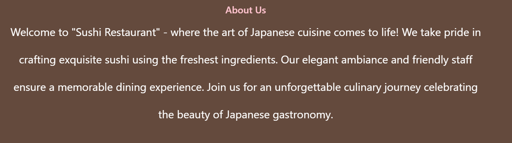

### Contact
* The contact us section provides some very key information such as the address, different contact methods such as phone number and email. But also the operating hours.

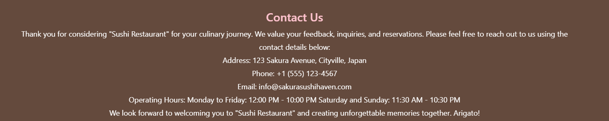

### Account Signup/Login
* This section shows the two forms that the user will have to fill out in order to be able to make any bookings to the restaurant.


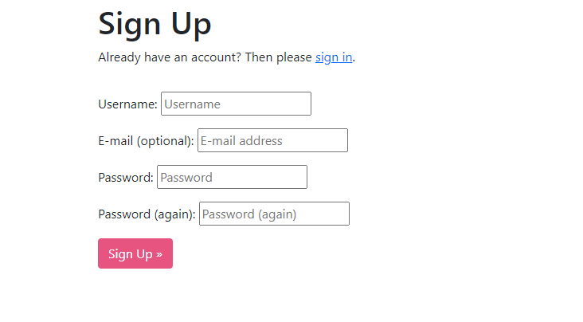

### Booking
* On the booking page, the user can decide when they want to visit the resturant. After the user has filled out the booking it will display on the "My bookings" page.

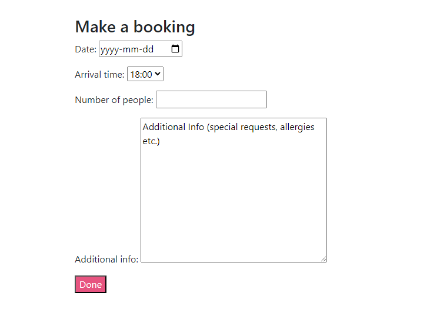

### My Bookings
* Here the user is able to see all their current bookings and a change to update/delete them if the user wishes. If the user decides to change a booking it will be taken to the prefilled out form of current information where the user can make its changed and then save. After that the new information will display on the my bookings page.

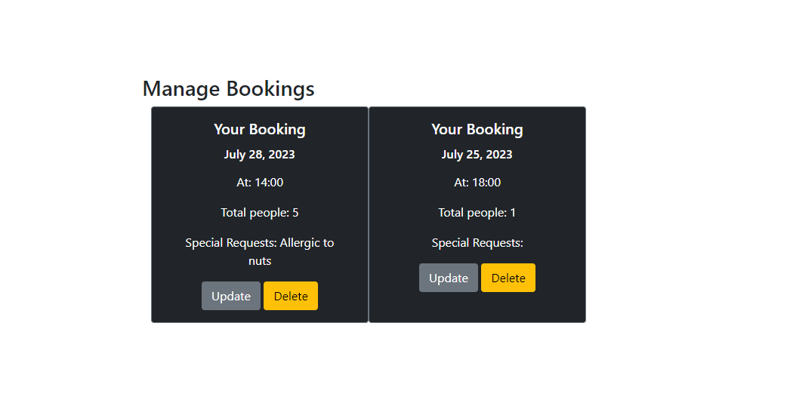

### Footer
* The footer contains some fake links to the restaurants social media accounts.


### Future Features
* Add functionality to assign a booking to a table
* Make it so that when trying to make a booking, only available times for when the resturant is not full is being displayed.
* Further improve the styling of the website to make it more appealing to visitors
* Create a function in the admin panel so that an admin can change the menu or add in different menus for lunch and dinner.
* A pop-up warning for the user if they try to delete a booking to make sure they accidentally don't do it.

## Technologies Used

### Languages
* Python
* HTML5
* CSS

### Frameworks and Libraries
* OS
* dj-database-url
* Django
* django-allauth
* gunicorn
* psycopg2

### Programs and tools
* Google Fonts
    * To incorporate font styles
* Bootstrap
    * Used to create the design for the website
* Gitpod
    * Gitpod was the IDE used for this project
* GitHub
    * Was used for storing and backup of the code
* Wireframes.cc
    * Was used to create the wireframes
* AmIResponsive
    * Was used to create the image atop of the readme

## Testing

#### Menu page
| Testing  | Steps | Expected Outcome | Results |  
| - | - | - | - |
| Customer can view menu page | See if the menu page is visible from the homepage | Being able to open and browse the menu without errors | PASS |

#### Registration 
| Testing  | Steps | Expected Outcome | Results |  
| - | - | - | - |
| Customer signup page | From the navigation bar, click signup | Customer is directed to the signup page | PASS |
| Customer signup - Form validation | Submit empty form | Form validation prompts the user | PASS |
| Customer signup - Form validation | Try to submit invalid password | Form validation prompts the user | PASS |
| Customer signup - Form validation | Try to submit non matching passwords | Form validation prompts the user | PASS |
| Customer signup - Form validation | Submit already taken username | Form validation prompts the user | PASS |
| Customer login page | From the navigation bar, click on the login button | Customer is directed to the login page | PASS |
| Customer login - Form validation | Submit incorrect password | Form validation prompts the user | PASS |
| Customer login - Form validation | Submit incorrect name | Form validation prompts the user | PASS |
| Customer Logout page | From the navigation bar the logout button was pressed | User is taken to a screen to validate that they are sure about logging out | PASS |
| Customer Logout page | After clicking logout and being taken to the are you sure page and clicking sign out | User is being signed out and taken back to homepage | PASS |

#### Bookings 
| Testing  | Steps | Expected Outcome | Results |  
| - | - | - | - |
| Form validation Booking page | Check that each required field is working | Form validation prompts the user | PASS |
| Submit button Booking page | Click the submit button to check that the booking is saved | Success message and redirect to mybooking page | PASS |
| Bookings are shown on mybookings page | Check that each booking for a user are shown on the mybookings page | Individual cards of each booking is shown with the corresponding booking details | PASS |
| Bookings can be updated | Check that the update button works and that the updated booking is submitted to the mybooking page when edited | Booking is updated with the corresponding booking details | PASS |
| Bookings can can be deleted | Check that the delete button works and that the deleted booking is removed from the mybooking page when deleted | Mybooking list is updated | PASS |

#### Navbar
| Testing  | Steps | Expected Outcome | Results |  
| - | - | - | - |
| Navbar | Check that each link is working correctly | Customer is able to open each link to browse the webpage for information about the restaurant | PASS |

#### Admin
| Testing  | Steps | Expected Outcome | Results |  
| - | - | - | - |
| Admin login - Form validation | Submit incorrect password | Form validation prompts the user | PASS |
| Admin login - Form validation | Submit incorrect name | Form validation prompts the user | PASS |
| Admin login - Form validation | Submit incorrect name | Form validation prompts the user | PASS |

### Further Testing

* The website was tested on different browsers such as, Google Chrome, Safari and Mozilla Firefox. Extensive testing was done to make sure that all the navigation links and all the functionality of the website still works.
* W3C Markup Validator
    * No errors or warnings were found on any page
* W3C CSS Validator
    * No error or warnings were found
* Python Validator
    * No error or warning that was relevant was shown

### Fixed Bugs

* A problem where when changing from ElephantSQL to SQLite made it so the previous users where not stored in the database anymore.
* CSS styling did not show up when deploying to Heroku

### Remaining Bugs

* The social media links in the footer are not clickable
* The redirecting of when a user tries to access pages via typing in a manual url where they shouldn't have access to can sometimes break the website.
* The burger menu doesn't show up as it should on smaller screens. I tried to fix this by creating a seperate menu for mobile and then having a class that displays none on larger screens and displays on smaller. However when I tried to add the class to the navigation and add the css styling, something broke and the css file was not being read anymore when I ran the website. There were no faults or error messages, but for some reason it didn't read the css file anymore so therefore I couldn't fix the burger menu like I indented to.

### Testing User Stories

* First Time Visitor Goals
    * As a first time visitor I can signup to the booking system in order to in the future be able to create bookings.
        * The signup button is easily accesible from the navigation menu on all pages when a user isn't already logged in. And the signup form is easy to understand and works as expected
    * As a first time visitor I can read the menu to see if the food is interesting and appealing.
        * The menu is located on the home page and is the first thing a user sees when accessing it.
    * As a first time visitor I can learn about the restaurant, some key information and location as well as how to get in contact via email, phone or social media.
        * All the information regarding location, contact etc. is found on the home page if the user scrolls down or by clicking in the navigation bar
* Returning Visitor Goals
    * As a returning visitor I can create an account so that in the future I can make my first booking
        * From the navigation menu the signup button is located or if a user tries to log in without an account they will be shown a link to the signup form.
    * As a returning visitor I can check the menu to see if there are any specials or if the menu has changed.
        * The menu is located on the home page.
* Frequent User Goals
    * As a frequent user I can login to manage already existing bookings.
        * As soon as the user logs in from the login page, the navigation bar will update and new links to book a table or view my bookings will appear.
    * As a frequent user I can find my current bookings.
        * If the user locates to the my bookings page after logging in, all bookings the user has made will be shown.

## Deployment
The site was deployed using Heroku. The steps to deploy are:
- Install Django & Gunicorn:
```pip3 install 'django<4' gunicorn```
- Install Django database & psycopg:
```pip3 install dj_database_url psycopg2```
- Creating the requirements.txt file with the following command:
```pip3 freeze --local > requirements.txt```
- a django project was created using:
```django-admin startproject Restaurant .```
- the restaurantapp app was then created with:
```python3 manage.py startapp RestaurantApp```
- These were then added to the settings.py file within our project directory.
- the changes were then migrated using:
```python3 manage.py migrate```
- After that go to [Heroku](www.heroku.com) & created a new app called RestaurantApp.
- added the Heroku Postgres database to the Resources tab.
- navigated to the Settings Tab, to add the following key/value pairs to the configvars:
1. key: SECRET_KEY | value: your own private secret_key
2. key: PORT | value: 8000
4. key: DATABASE_URL | value: value supplied by Heroku
- added the DATABASE_URL & SECRET_KEY to the env.py file
- added the DATABASE_URL & SECRET_KEY to the settings.py file
- add an import os statement for the env.py file.
- added Heroku to the ALLOWED_HOSTS in settings.py
- created the Procfile
- pushed the project to Github
- connected my github account to Heroku through the Deploy tab
- connected my github project repository, and then clicked on the "Deploy" button

## Credits

### Code 
* [Django Documentation](https://www.djangoproject.com/) was used to help with Django issues throughout the project.
* [Bootstrap Documentation](https://getbootstrap.com/) was used to help with the styling of the website
* [Code Institute Walkthrough Projects](https://codeinstitute.net/se/) was used as inspiration and lots of ideas on how to build up the models, views, templates etc.
* [ErikHGMs Firehouse Project](https://github.com/ErikHgm/FireHouse-Restaurant-Project) was an inspiration on how to implement a working restaurant website. The main inspiration from Erik was his bootstrap layout so that everything looked nice and centered.

### Content
* [ChatGPT](https://openai.com/chatgpt) was used to create the about us and contact section for a fake sushi restaurant.

### Acknowledgements
* My mentor Martina for her support and help throughout
