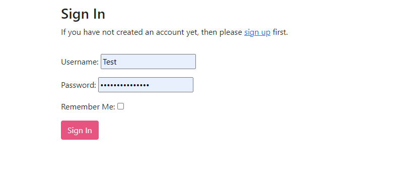

# Sushi Restaurant

The goal for this project was to create a fictional sushi restaurant with a functional booking system, a menu, and some other information about the restaurant. The user can signup to be able to make bookings to the restaurant with some key information such as: what time they want to book the table, how many guests and if they have any allergies, special requests etc. 

The live link can be found here: [Sushi Restaurant](https://restaurant-booking-app-p4-62d98244b1cc.herokuapp.com/)

## User Experience (UX)

### Project Goals

The goal of this project was to build a working booking system for a fictional restaurant so that customers would have an easy way to create, update and delete their bookings on. The goal was not so much to make it visually impressive but to make it functional and easy to understand.

* First Time Visitor Goals
    * As a first time visitor I can signup to the booking system in order to in the future be able to create bookings.
    * As a first time visitor I can read the menu to see if the food is interesting and appealing.
    * As a first time visitor I can learn about the restaurant, some key information and location as well as how to get in contact via email, phone or social media.

* Returning Visitor Goals
    * As a returning visitor I can create an account so that in the future I can make my first booking
    * As a returning visitor I can check the menu to see if there are any specials or if the menu has changed.

* Frequent User Goals
    * As a frequent user I can login to manage already existing bookings.
    * As a frequent user I can find my current bookings.

### Agile Methodology

An agile approach was taken when creating this project. By assigning user stories to common issues and taking advantage of the GitHub Kanban board and its features, the process of making sure that everything that was needed was included in the project in order to make a user friendly and accesible.

### Design

* The design for the project was structured to be easy to read, easy to understand where to get the inforamtion you would need in order to access the website like how it was intended.
* The main colors for this project a lighter brown with some pink, black and white details on the front page to give a high contrast of colors and make everything easy to read.

### Wireframes

### Database Schema
* The database schema can be found below where there is a foreign key field of User that realtes to the Django standard User model class.

## Features

### Navbar
* The navbar shows all the sections you can access whilst logged in or logged out. If you're logged in, the navbar will update so that you can easily access your bookings page and also quickly make a new booking. If the user is not logged in, they will instead be shown links to login and signup.

### Menu
* The menu section comes with everything the restaurant has to offer, it shows the sushis name in both japanese and english and also it's price in Yen, the currency of Japan to achieve that luxury abroad feeling.

### About Us
* The about us section displays a warm welcoming message to user and tells a little bit of short information about the restaurant.

### Contact
* The contact us section provides some very key information such as the address, different contact methods such as phone number and email. But also the operating hours.

### Account Signup/Login
* This section shows the two forms that the user will have to fill out in order to be able to make any bookings to the restaurant.

### Booking
* On the booking page, the user can decide when they want to visit the resturant. After the user has filled out the booking it will display on the "My bookings" page.

### My Bookings
* Here the user is able to see all their current bookings and a change to update/delete them if the user wishes. If the user decides to change a booking it will be taken to the prefilled out form of current information where the user can make its changed and then save. After that the new information will display on the my bookings page.

### Footer
* The footer contains some fake links to the restaurants social media accounts.

### Future Features
* Add functionality to assign a booking to a table
* Make it so that when trying to make a booking, only available times for when the resturant is not full is being displayed.
* Further improve the styling of the website to make it more appealing to visitors
* Create a function in the admin panel so that an admin can change the menu or add in different menus for lunch and dinner.

## Technologies Used

### Languages
* Python
* HTML5
* CSS

### Frameworks and Libraries
* OS
* dj-database-url
* Django
* django-allauth
* gunicorn
* psycopg2

### Programs and tools
* Google Fonts
    * To incorporate font styles
* Bootstrap
    * Used to create the design for the website
* Gitpod
    * Gitpod was the IDE used for this project
* GitHub
    * Was used for storing and backup of the code
* Wireframes.cc
    * Was used to create the wireframes
* AmIResponsive
    * Was used to create the image atop of the readme

## Testing

* Manual testing has been done for the website. Every link that a user can access from the homepage works as expected. The only issues I could find with the functionality would be if the user tried to write urls that they would not have access to. For example if an anonymous user tries to access links that only logged in users should have access to, the redirecting of that can sometimes not work as expected. 
* All the links in the navbar work as expected
* The login/signup form both work as expected and the users information is stored in the database so that they can just login in the next time they visit.
* The booking form works well, after a user saves the booking, the booking is displayed in the my bookings page.

### Fixed Bugs

* A problem where when changing from ElephantSQL to SQLite made it so the previous users where not stored in the database anymore.
* CSS styling did not show up on heroku

### Remaining Bugs

* The social media links in the footer are not clickable
* The redirecting of when a user tries to access pages via typing in a manual url where they shouldn't have access to can sometimes break the website.

## Deployment

## Credits

### Code 
* [Django Documentation](https://www.djangoproject.com/) was used to help with Django issues throughout the project.
* [Bootstrap Documentation](https://getbootstrap.com/) was used to help with the styling of the website
* [Code Institute Walkthrough Projects](https://codeinstitute.net/se/) was used as inspiration and lots of ideas on how to build up the models, views, templates etc.
* [ErikHGMs Firehouse Project](https://github.com/ErikHgm/FireHouse-Restaurant-Project) was an inspiration on how to implement a working restaurant website. The main inspiration from Erik was his bootstrap layout so that everything looked nice and centered.

### Content
* [ChatGPT](https://openai.com/chatgpt) was used to create the about us and contact section for a fake sushi restaurant.
